<div align="center">
  
</div>

<br>

<!-- as duas imagens ficam na MESMA linha de propósito: qualquer espaço entre elas
     vira um gap de ~4px e estoura a largura útil do README (~828px), quebrando a linha -->
<div align="center">
  
</div>

<br>

<div align="center">
  
</div>

<br>

### O que a gente constrói

**Atendimento com IA** — agentes que respondem, qualificam e agendam em WhatsApp, Instagram e web. Sem fila, sem horário comercial.

**Automação da operação** — integrações e fluxos que tiram o trabalho manual do meio do caminho: lead entra, contexto é montado, time recebe pronto.

**Portais sob medida** — Next.js e Supabase, dados em tempo real, acesso isolado por cliente.

<br>

### Como este perfil foi feito

Todo o visual aqui é SVG gerado por script e commitado no repositório — nenhum serviço externo de badge ou card. Carrega instantâneo, não quebra quando um serviço de terceiro cai e a animação é CSS pura (o GitHub bloqueia `<script>` em README).

| Arquivo | O que faz |
|---|---|
| [`scripts/render_hero.py`](scripts/render_hero.py) | Banner com wordmark e taglines em typing |
| [`scripts/render_mark.py`](scripts/render_mark.py) | Converte o monograma PNG em ASCII art com dithering ordenado |
| [`scripts/render_card.py`](scripts/render_card.py) | Cartão estilo `neofetch` com stack e status |
| [`scripts/fetch_contributions.py`](scripts/fetch_contributions.py) | Lê o calendário público de contribuições (sem token) |
| [`scripts/render_heatmap.py`](scripts/render_heatmap.py) | Desenha o heatmap na paleta da marca |

O heatmap é regerado todo dia por [GitHub Actions](.github/workflows/update-profile.yml). Os demais painéis são estáticos — rode o script depois de editar o conteúdo:

```bash
pip install -r requirements.txt
python scripts/render_hero.py            # banner
python scripts/render_card.py            # cartão de sistema
python scripts/fetch_contributions.py    # dados
python scripts/render_heatmap.py         # heatmap
STATIC=1 python scripts/render_hero.py   # frame final, sem animação
```

<br>

### Contato

**Site** · [metho.com.br](https://metho.com.br) &nbsp;·&nbsp; **Portal** · [app.metho.com.br](https://app.metho.com.br) &nbsp;·&nbsp; **Instagram** · [@metho.oficial](https://instagram.com/metho.oficial) &nbsp;·&nbsp; **E-mail** · [metho.oficial@gmail.com](mailto:metho.oficial@gmail.com)

<sub>Santa Catarina, Brasil</sub>
